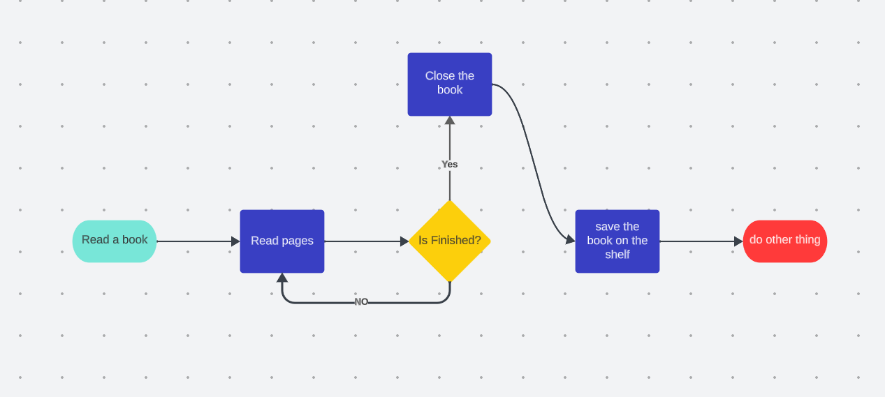

# What is algorithms?

algorithms was a set of step by step that have a objective: finally a work.

And these algorithms have types like loop algorithms and conditional algorithms. In additional to sequential algorithms.

- This is a example of `LOOP` algorithm:

- And this is a example of `CONDITIONAL` algorithm:

